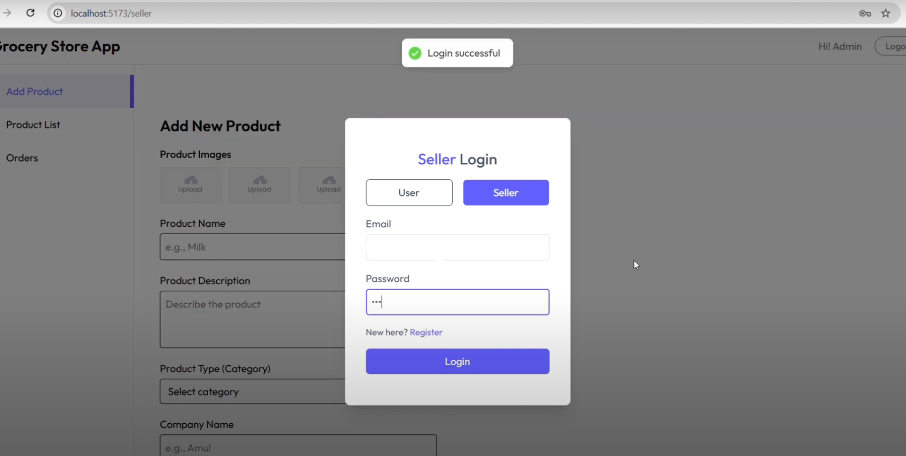
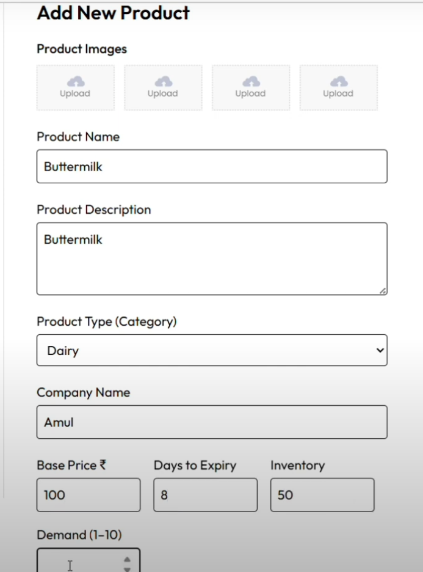
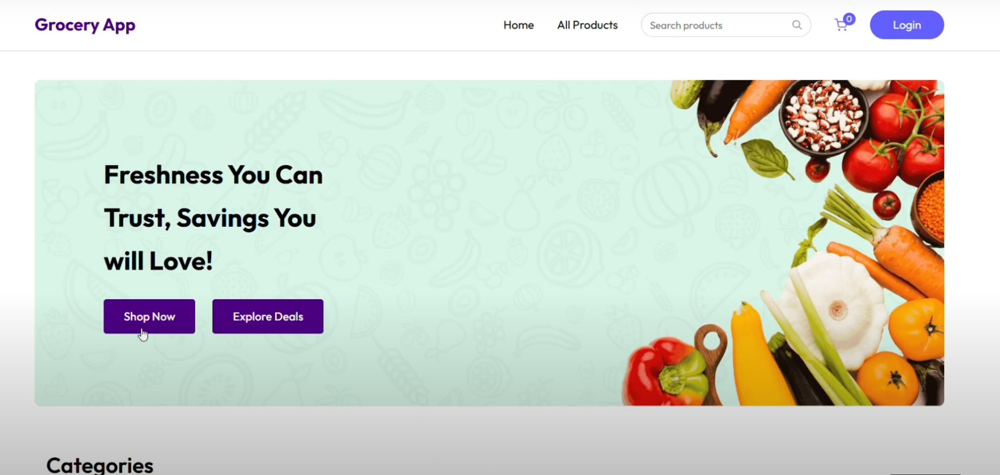
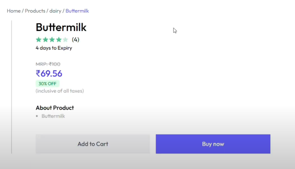
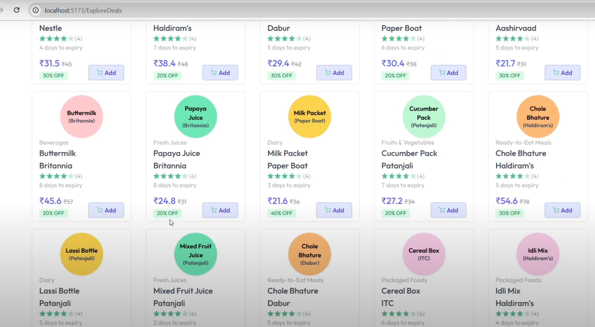
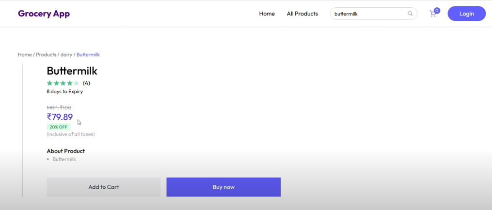

# 🛒 Grocery Store Web Application with ML-Driven Price Prediction

Welcome to the **Grocery Store App** — a dynamic and responsive full-stack web application for managing and browsing grocery items. This project also features a **Machine Learning model** that intelligently predicts the **selling price** of products based on:

- **Demand level**
- **Stock availability**
- **Expiry date proximity**

---

## 🔥 Features

- 🛍️ Add and manage grocery products as a seller
- 👥 User and seller login
- 📸 Upload multiple product images
- 📈 ML model for price prediction using:
  - Inventory
  - Days to Expiry
  - Base Price
  - Demand (1–10 scale)
- 🛒 Explore and add discounted products to cart
- 💡 Auto-discount logic integrated with expiry and demand
- 📦 Products shown with predicted price, MRP, and offer %

---

## 🧠 Price Prediction (ML Model)

This app uses a regression-based ML model trained on historical product trends. The model predicts an ideal **discounted price** considering:

| Feature       | Description                      |
|---------------|----------------------------------|
| Base Price ₹   | Original price of the product     |
| Days to Expiry| Freshness (lesser days → more discount) |
| Inventory     | Stock (higher stock → more discount) |
| Demand        | Customer demand (higher demand → less discount) |

---

## 🖼️ Screenshots

### 🔐 Seller Login


### ➕ Add New Product


### 🏠 Home Page


### 🧾 Product Detail with Predicted Price


### 🎉 Explore Deals Section


### 🛍️ Price Prediction Example with 8 Days to Expiry


> 📁 Ensure that the above images are stored in a `/screenshots` folder in the project root.

---

## 🛠️ Tech Stack

- **Frontend**: React.js, HTML5, CSS3, Tailwind CSS
- **Backend**: Node.js, Express.js
- **Database**: MongoDB
- **ML Model**: Python (scikit-learn) integrated via Flask API
- **Authentication**: JWT-based login for Users & Sellers

---

## 🚀 How to Run Locally

1. **Clone the repo**  
   ```bash
   git clone https://github.com/yourusername/grocery-store-ml.git
   cd grocery-store-ml
   ```

2. **Install frontend dependencies**  
   ```bash
   cd client
   npm install
   npm start
   ```

3. **Install backend dependencies**  
   ```bash
   cd ../server
   npm install
   npm start
   ```

4. **Run ML model (Flask API)**  
   ```bash
   cd ../ml-model
   pip install -r requirements.txt
   python app.py
   ```

---

## 📊 Sample Prediction Logic (Server)

```python
# Example logic in Python (Flask)
def predict_price(base_price, days_to_expiry, inventory, demand):
    discount = (10 - demand) * 0.02 + (inventory / 100) * 0.1 + (10 - days_to_expiry) * 0.03
    final_price = base_price * (1 - min(discount, 0.4))  # Cap at 40% max discount
    return round(final_price, 2)
```

---

## 🧑‍💻 Author

**Lakshya Soni**

> Made with ❤️ and ML for modern grocery retail!

---

## 📜 License

This project is open source and available under the [MIT License](LICENSE).
